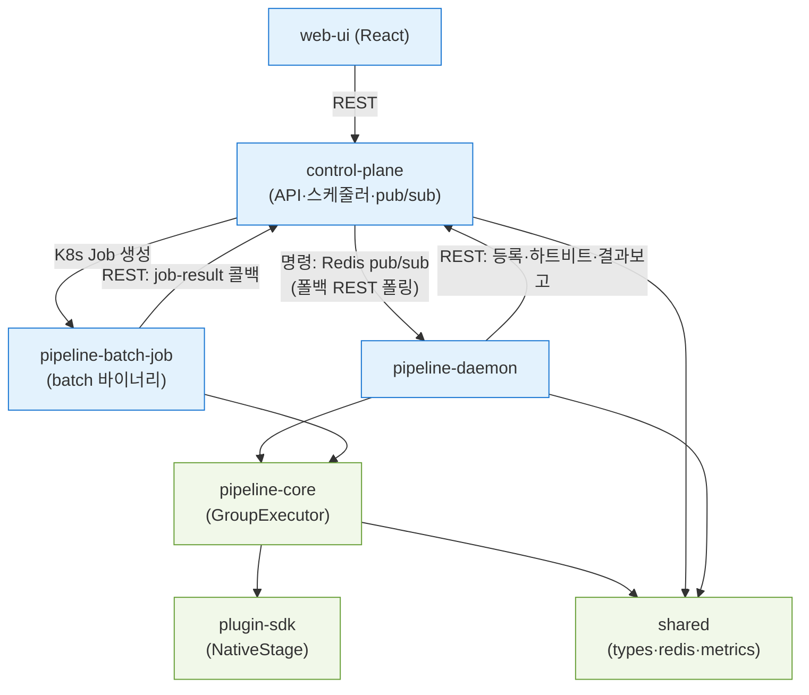
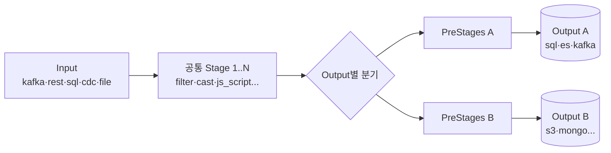
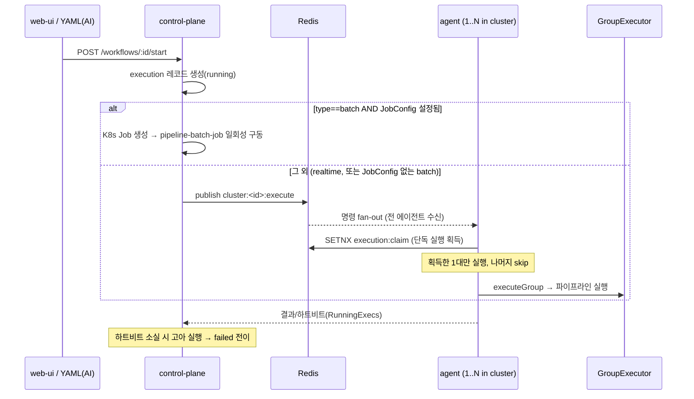
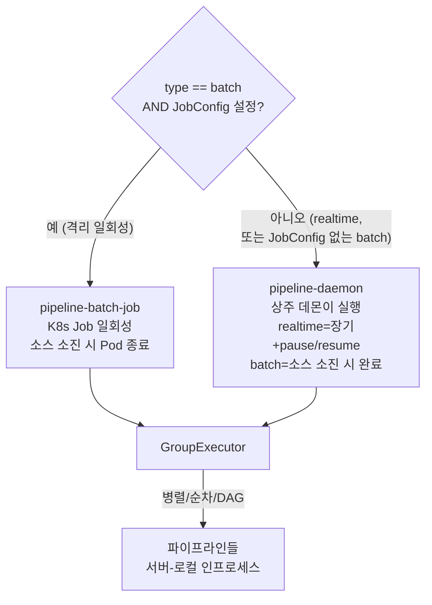

# Conduix 아키텍처 개요

> 프로젝트의 가치·설계·구현을 핵심 위주로 정리한 단일 참조 문서. (2026-07-02 기준, 현재 구현 반영)
> 세부 문서는 [docs/README.md](README.md) 인덱스 참조. 완료·폐기 문서는 [archive/](archive/).

## 1. 가치 (왜 만드는가)

성격이 다르지만 흐름이 유사한 데이터 파이프라인을 **매번 새로 만들지 않고 플랫폼화**한다.

- **유사 흐름 재사용**: 벌크/실시간, 소스만 다른 파이프라인을 템플릿으로 복제 (id만 빼면 템플릿)
- **이중 인터페이스**: 사람은 **web-ui**, AI·프로그래밍은 **YAML**로 동일하게 생성/제어
- **성능 타협 없는 유연성**: Python 같은 편의를 **Go 네이티브 속도**로
- **분산 클러스터링**: 여러 워크플로우를 여러 서버에 배치 (파이프라인은 서버-로컬 실행으로 데이터 로컬리티 유지)
- **web-ui로 커스텀 stage 추가**: 스크립트(즉시) 또는 Go 네이티브(빌드)

## 2. 모듈 구성

| 모듈 | 역할 | 의존 |
|------|------|------|
| `shared/` | 공통 타입·유틸 (Redis ResilientClient, 메트릭) | 없음 |
| `plugin-sdk/` | 네이티브 stage 인터페이스 (`NativeStage`) | 없음 |
| `pipeline-core/` | 실행 엔진 (GroupExecutor, source/stage/output, 체크포인트) | shared, plugin-sdk |
| `pipeline-daemon/` | **상주 데몬**: Redis로 명령 수신, 인메모리로 GroupExecutor 구동. realtime 및 JobConfig 없는 batch 담당. | shared, pipeline-core |
| `pipeline-batch-job/` | **일회성 K8s Job 바이너리**: 환경변수로 config 받아 GroupExecutor 한 번 구동 후 종료. `JobConfig`가 붙은 batch 전용. | shared, pipeline-core |
| `control-plane/` | 운영 백엔드 (Gin+GORM+MySQL, 스케줄러, Redis pub/sub) | shared, pipeline-core |
| `web-ui/` | 프론트엔드 (React+TS+MUI) | control-plane REST |

### 모듈 의존 관계



## 3. 파이프라인 모델



- 공통 Stage는 모든 Output 공유, PreStages는 Output 전용 변환. bulk(배치 벌크쓰기)/individual(건별) 선택.

- **Input**: kafka, rest_api, sql, sql_event, cdc, file, k8s_logs, mqtt, rabbitmq, sqs, websocket, redis_stream, pubsub 등
- **Stage**: filter, remap, cast, timestamp, encrypt, dedupe, validate, throttle, route, aggregate, enrich, js_script(goja) 등 28종
- **Output**: sql(mysql/postgres), elasticsearch, kafka, mongodb, s3, gcs, bigquery, rest_api
- **PreStages**: Output별 전용 변환 (bulk/record 양 모드 모두 적용)

**커스텀 stage**: 2-tier (플러그인 V4)
- **Script tier**: `js_script` — JavaScript(goja) 스크립트, 빌드 없이 즉시 실행. text→number, json 가공/추출 등.
- **Native tier**: Go 코드 → 단일 runner 이미지로 통합 빌드 (web-ui 편집기 → RunnerBuilder).

## 4. 실행 엔진 (pipeline-core)

- **GroupExecutor 단일 엔진.** (구 actor 엔진은 제거됨)
- 워크플로우 executor가 **stream 레지스트리로 위임**하여 28개 내장 stage + 네이티브 플러그인이 실제 실행됨.
- **배치 모드**(기본)와 레코드 모드. 배치는 워커 병렬 처리.
- **pause/resume**: context-aware pause gate (배치/레코드 양 루프).
- **재시도**: FailurePolicy.retry — 지수 백오프 + jitter(thundering herd 방지).
- **체크포인트**: 소스 오프셋 기반 복구.

### agent vs runner — 무엇이 다른가 (혼동 방지)

두 모듈은 **"어떤 데이터 타입을 처리하느냐"로 나뉘지 않는다.** 둘 다 동일한 `GroupExecutor`를 구동하며, 어떤 파이프라인(kafka/cdc/sql/rest…)이든 실행할 수 있다. 차이는 **"어떻게 구동·배포되느냐(생명주기)"** 다.

| | `pipeline-daemon` | `pipeline-batch-job` |
|---|---|---|
| 생명주기 | **상주 데몬** (항상 떠 있음) | **일회성** (실행 후 종료) |
| 명령 수신 | Redis Pub/Sub (REST 폴백) | 환경변수로 config 주입 |
| 배포 형태 | 항상 떠 있는 프로세스 | 필요할 때 K8s Job으로 생성 |
| 실행 엔진 | `GroupExecutor` | `GroupExecutor` (동일) |

**batch는 왜 두 경로로 갈리나?** — 데이터 타입이 아니라 워크플로우에 **`JobConfig`가 설정됐는지**로 갈린다. control-plane의 단일 분기(`workflow.go` StartWorkflow):

```
if type == batch AND JobConfig != "" AND K8s 사용가능:
    → pipeline-batch-job (K8s Job으로 격리 일회성 실행)   # 무겁거나 격리가 필요한 배치
else:
    → pipeline-daemon (상주 데몬이 인메모리 실행)         # realtime 전부 + JobConfig 없는 batch
```

즉 `JobConfig`는 "이 배치를 독립 K8s Job(전용 리소스·격리)으로 띄울지"를 정하는 **운영 선택**이다. 붙이지 않으면 realtime과 동일하게 상주 agent가 처리한다.

## 5. 분산 · 통신

**통신은 하이브리드** — 방향에 따라 채널이 다르다:

| 방향 | 채널 | 용도 |
|------|------|------|
| control-plane → agent | **Redis Pub/Sub** (주), REST 폴링(폴백) | 워크플로우 실행·제어 명령(start/stop/pause/resume/throttle) |
| agent → control-plane | **REST API** | 등록(`/agents/register`), 하트비트(`/agents/:id/heartbeat`), 실행 결과(`/workflows/:id/executions/:eid/result`) |
| K8s Job(runner) → control-plane | **REST API** | 배치 결과 콜백(`/internal/job-result`) |

- **모드 폴백**: agent는 `ModeRedis → ModeHybrid → ModeREST`. Redis 불가 시 명령을 `GET /agents/:id/commands`로 폴링. ResilientClient(재연결·서킷브레이커·로컬캐시).
- Redis Pub/Sub은 명령 fan-out에만 쓰고, 결과·상태는 REST로 DB에 직접 반영(진실원 = control-plane DB).
- **배치 단위**: 워크플로우 → 클러스터 채널(`cluster:<id>:execute`). **여러 에이전트 중 하나가 SETNX claim**으로 단독 실행 (중복 실행 방지).
- **파이프라인 = 서버-로컬**: stage 간 레코드가 인프로세스로 흐름(네트워크 홉 없음). 수평 확장은 Kafka 컨슈머 그룹(파티션 분산) 또는 워크플로우 배치로.
- **고아 실행 감지**: 담당 에이전트 크래시 시 scheduler가 running 실행을 failed로 전이(조용한 유실 방지).

### 실행 트리거 흐름 (start → 실행)



### 실행 프로세스 종류

분기 기준은 **워크플로우 type + `JobConfig` 유무** 단 하나다 (데이터 타입 아님):



> realtime과 batch의 실행 방식 차이(장기 vs 소스 소진 후 종료)는 GroupExecutor 내부에서 소스 특성으로 결정된다. agent/runner 선택과는 독립적이다.

## 6. 복원력 · 안전

- **서킷 브레이커**: 실행 중 sink/변환 실패가 임계(연속/누적) 초과 시 실행을 조기 에러 종료 — 실패 누적이 부하가 되는 것을 차단. (`FailurePolicy.CircuitBreaker`)
- **DLQ**: 설정 시 실패 레코드 적재(보존용, 서킷과 독립).
- **panic recover**: 한 파이프라인 panic이 에이전트 전체를 죽이지 않음.
- **실패 카운트/로그**: 모든 실패를 상관키(workflow/pipeline id) 포함 slog + Prometheus 메트릭.

## 7. 관측성

- **Prometheus**: `/metrics` (agent + control-plane). 실행 수(status별), 처리 레코드, 실행 시간 히스토그램, 활성 실행 게이지, 재시도·서킷트립 카운터.
- **구조화 로깅**: 파이프라인 실행 완료/실패에 workflow_id·pipeline_id 상관키(slog).

## 8. 운영 인터페이스

- **web-ui**: 워크플로우 생성·제어(start/stop/pause/resume), 처리량·실행상태 모니터링, YAML 내보내기/복제/가져오기.
- **YAML(프로그래밍/AI)**: `GET /workflows/:id/yaml`(export), `POST /workflows/import`(생성). export→id/project 교체→import = 템플릿 인스턴스화. web-ui와 동일 모델(`buildWorkflowModel`로 일원화).
- **샘플**: 첫 실행 시 "Sample Pipelines" 프로젝트에 6종(bulk 3 + cdc 3) 워크플로우가 자동 등록된다(삭제 가능, 삭제 후 재시딩 안 함). 각 샘플은 `js_script` 커스텀 stage(text→number, json 가공, json 추출)를 포함해 빌드 없이 즉시 실행된다. (`control-plane/internal/seed`)

## 9. 알려진 제약 (정직한 현황)

- **PostgreSQL CDC**: 미지원(생성 시 조기 거부). MySQL CDC 또는 Kafka(Debezium) 경유.
- **단일 파이프라인 수평 샤딩**: 미지원 — 로컬리티 우선. Kafka 파티션/워크플로우 배치로 확장.
- **자동 실행 재개**: 고아 실행은 failed 전이까지(인지 가능). checkpoint 기반 자동 재실행은 미구현.
- 상세: [REMAINING_WORK_CHECKLIST.md](REMAINING_WORK_CHECKLIST.md)
